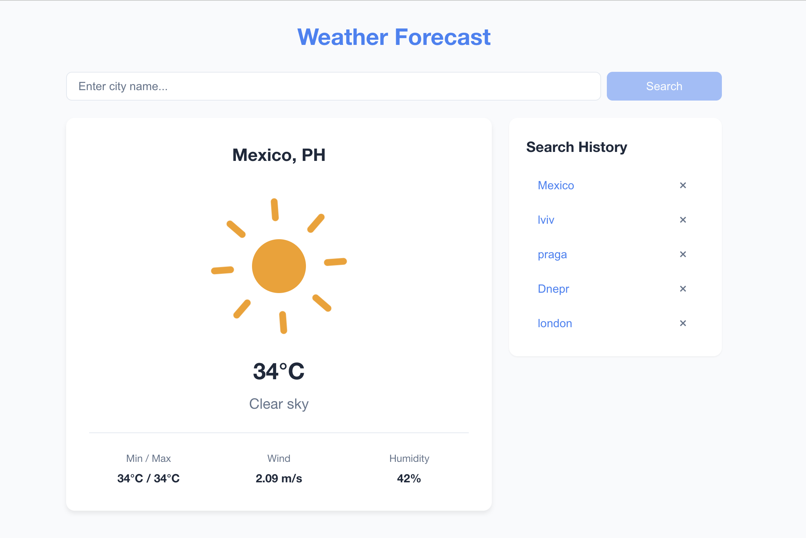

# Weather Forecast



Search weather by city. Shows temperature, wind, humidity, animated icons. Keeps search history in localStorage with undo on delete.

## Setup

```bash
cp .env.example .env   # add your OpenWeatherMap API key
npm install
npm run dev
```

Free API key: [openweathermap.org/api](https://openweathermap.org/api)

## Scripts

| Command | What it does |
|---------|-------------|
| `npm run dev` | Start dev server |
| `npm run build` | Production build |
| `npm run test` | Run tests |
| `npm run test:coverage` | Tests + coverage report |
| `npm run lint` | ESLint |
| `npm run format` | Prettier |

## Stack

React, TypeScript (strict), Vite, CSS Modules, Axios, Vitest + Testing Library + MSW

## Notes

- API responses are cached in memory for 5 minutes
- Search history persists across page reloads (localStorage)
- `.env` is gitignored — don't commit your API key
